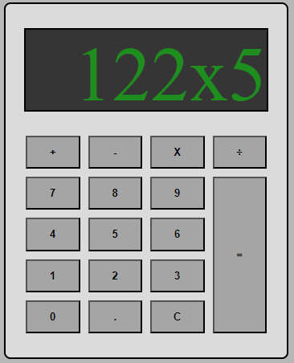

# Calculadora Simples

Uma calculadora simples desenvolvida em HTML, CSS e JavaScript.

## Funcionalidades

- Adição, subtração, multiplicação e divisão.
- Tratamento básico de erros.
- Interface amigável.

[Acessar Calculadora](https://italomartinsg.github.io/calculadora-js/)

Desenvolvido por Ítalo Martins
